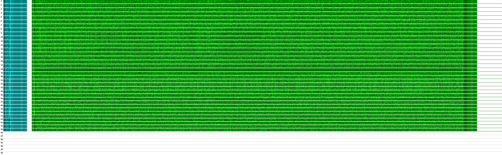

# visualize_1541

`visualize_1541` is a tool that creates visualizations of the data layout on `G64` Commodore 1541 disk images.

## Circular

This representation is useful to visualize custom disk formats and differences in gap sizes.

* Every track starts at the bottom and is drawn counter-clockwise.
* Green represents the data. Darker areas have more 0-bits.
* Red represents a longer sequence of 1-bits.
* Blue represents a longer sequence of 0-bits.

      python visualize_1541.py disk.g64 disk.png

## Sector-by-sector

This representation is useful to visualize errors on Commodore-formatted disks. The tool decodes SYNC marks and sector headers.

* Every pack of 17-21 lines is a track, numbered 1-41.
* Every line within a pack is one sector.
* The raw sector contents are drawn from left to right.
* The cyan part is the header, the green part the data.
* Black is 0, cyan/green is 1.
* White represents missing header or sector sections.

      python visualize_1541_blocks.py disk.g64 disk.png

## More Information

There are two articles about these tools:

* [Visualizing Commodore 1541 Disk Contents](https://www.pagetable.com/?p=1070)
* [Visualizing Commodore 1541 Disk Contents – Part 2: Errors](https://www.pagetable.com/?p=1356)

## Limitations

These are some limitations of the tool for the circular representation:

* Because the Pillow library cannot draw antialiased lines, the tool renders the image at 16x (!) the resolution and scales it down at the end. This uses *a lot* of memory, yet there are still Moiré artifacts. Using a different image library would be a good idea.
* Red areas (SYNCs marks) show up as soon as there are 8 1-bits. SYNC detection on the 1541 requires at least 10. (The sector-by-sector tool contains logic for correct SYNC detection that should be ported over.)
* The data area shows the GCR data. An option should be added to show the GCR-decoded data.
* `nibtool` `.nbz` files are better suited as sources, the tool should be extended to support them.

## Author

Michael Steil <mist64@mac.com>, https://www.pagetable.com/